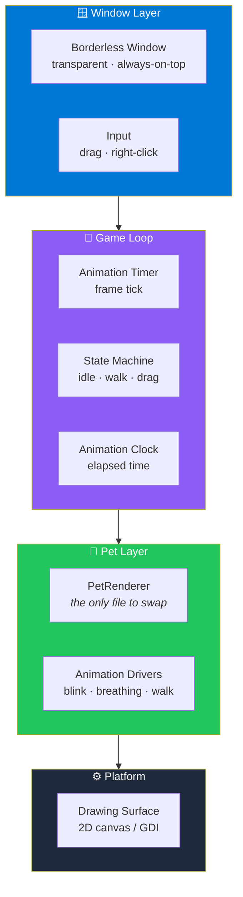
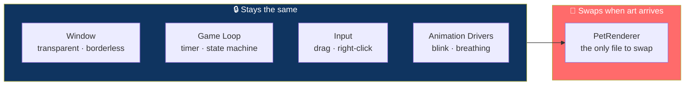

# 🐾 PixelPet — Phase 1

<div align="center">


**A tiny desktop pet that lives on your screen.**

*Transparent · Borderless · Always on top*

[🚀 Build & Run](#-build--run) • [✨ What's in Phase 1](#-phase-1-scope) • [🏗️ Architecture](#️-architecture) • [🗺️ Roadmap](#-roadmap)

</div>

---

## 📖 Overview

**PixelPet** is a tiny desktop pet — a small animated creature that lives on top of your other windows, walks around, blinks, breathes, and can be dragged anywhere on your screen.

### Core Idea

> **One file to swap. Everything else stays.**
>
> `Pet/PetRenderer` is the **only file that changes** when real sprite sheets arrive. The window, the animation loop, and the drag-and-drop logic are all independent of the art.

### 🎯 Phase 1 Scope

<div align="center">

| ✅ Included | ❌ Not Yet |
|:---:|:---:|
| Transparent borderless always-on-top window | Real sprite sheets |
| Procedural placeholder pet | Save / restore position |
| Idle + walk animation | Feeding, stats, or needs |
| Blink | Multiple pets |
| Breathing | Interaction beyond drag |
| Drag & drop | Settings UI |
| Right-click quits | Tray icon |

</div>

> 💡 **The pet is a placeholder for now** — drawn procedurally so the app has something to show while the real art pipeline is being built.

---

## 🚀 Build & Run

### Requirements

| Requirement | Version |
|-------------|---------|
| **OS** | Windows 10 / 11 |
| **Compiler** | Visual Studio 2022 **or** MinGW |
| **CMake** | **3.24+** |

### Build Steps

```bash
cmake -S . -B build
cmake --build build --config Release
```

### Run

```bash
build/Release/PixelPet.exe
```

> 💡 **That's it.** No installer, no dependencies, no registry changes.

---

## ✨ Phase 1 Scope

<div align="center">

| 🪟 Window | 🐾 The Pet |
|:---:|:---:|
| Transparent · borderless · always-on-top | Procedurally drawn placeholder |
| **🎬 Animation** | **🖱️ Interaction** |
| Idle · walk · blink · breathing | Drag & drop anywhere on screen |
| **🚪 Exit** | |
| Right-click quits for now | |

</div>

### 🪟 The Window

- **Transparent** — no background, just the pet
- **Borderless** — no title bar, no chrome
- **Always on top** — stays visible above other windows

### 🐾 The Pet

- **Procedurally drawn placeholder** — something to look at while real art is built
- **Idle animation** — subtle movement when doing nothing
- **Walk animation** — used while the pet is being dragged or wandering
- **Blink** — occasional eye animation for life
- **Breathing** — a subtle scale pulse that makes the pet feel alive

### 🖱️ Interaction

- **Drag & drop** — pick the pet up and place it anywhere on screen

### 🚪 Exit

- **Right-click quits** — a simple escape hatch for Phase 1

> 📝 **This will be replaced** with a proper tray icon menu in a later phase.

---

## 🏗️ Architecture

### System Overview



### The One File That Changes



> 💡 **When real sprite sheets arrive, only `Pet/PetRenderer` changes.** The window, the loop, and the drag logic all stay exactly as they are.

### Design Principles

<div align="center">

| Principle | Implementation |
|-----------|---------------|
| **🎨 Art is isolated** | `Pet/PetRenderer` is the only file that knows how the pet looks |
| **🪟 Window is transparent and borderless** | The pet appears to live directly on your desktop |
| **📌 Always on top** | The pet stays visible above other windows |
| **🔄 Animations are driven, not hard-coded** | Blink, breathing, and walk are separate drivers on a clock |
| **🖱️ Minimal interaction** | Drag to move, right-click to quit — nothing else needed in Phase 1 |
| **📦 Zero runtime dependencies** | Just CMake and a C++17 compiler |

</div>

---

## 📁 Project Structure

```
PixelPet/
├── CMakeLists.txt          # Build configuration
├── Pet/
│   └── PetRenderer.*       # ← The only file to swap when real art arrives
├── <platform code>          # Window creation, input handling, game loop
└── build/                   # Generated — not committed
```

> 💡 **`Pet/PetRenderer` is intentionally isolated.** Nothing else in the codebase needs to know how the pet is drawn — only *when* and *where*.

---

## 🗺️ Roadmap

### ✅ Phase 1 — Current

- [x] Transparent borderless window
- [x] Always-on-top
- [x] Procedurally drawn placeholder pet
- [x] Idle animation
- [x] Walk animation
- [x] Blink animation
- [x] Breathing animation
- [x] Drag & drop the pet anywhere on screen
- [x] Right-click to quit
- [x] CMake build with VS 2022 and MinGW
- [x] Zero runtime dependencies

### 🔜 Future Phases

- [ ] **Real sprite sheets** — swap `Pet/PetRenderer` only
- [ ] **Save / restore position** — the pet remembers where it was
- [ ] **Tray icon** — proper exit menu, settings access
- [ ] **Wandering** — the pet walks around on its own
- [ ] **Multiple pets** — spawn more than one
- [ ] **Feeding and needs** — hunger, happiness, energy
- [ ] **Interaction** — pet the pet, play animations
- [ ] **Settings UI** — size, speed, animation preferences
- [ ] **Start with Windows** — optional autostart
- [ ] **Sound** — subtle chirps or ambient noises

---

## 🤝 Contributing

Contributions are welcome. Please:

1. Fork the repository
2. **Keep `Pet/PetRenderer` isolated** — no other file should know how the pet is drawn
3. **Keep the window layer separate from the pet layer** — the pet shouldn't touch platform code
4. **Keep it dependency-free** — no external runtime libraries
5. **Preserve the drag-and-drop behavior** — it should feel physical, not laggy
6. Test on both Visual Studio 2022 and MinGW
7. Submit a Pull Request

### Guidelines

- **Never hard-code art into the window layer** — it belongs in `PetRenderer`
- **Never add a runtime dependency** — Phase 1 is intentionally self-contained
- **Never assume a fixed screen size** — the pet must work on any display
- **Never break the build on MinGW** — both toolchains matter
- **Never ship compiled artifacts** — `build/` stays out of the repo

---

## 📜 License

MIT — see [LICENSE](LICENSE) for details.

---

## 🙏 Acknowledgments

- **CMake** — for making a C++ desktop app this portable
- **Every desktop pet that ever kept someone company at 3 AM** — this one's for you

---

<div align="center">

### 🐾 A TINY FRIEND ON YOUR DESKTOP.

**Transparent. Borderless. Always on top.**

**One file to swap. Everything else stays.**

<br>

⭐ If this pet kept you company, consider giving it a star.

<br>

[⬆ Back to Top](#-pixelpet--phase-1)

</div>
